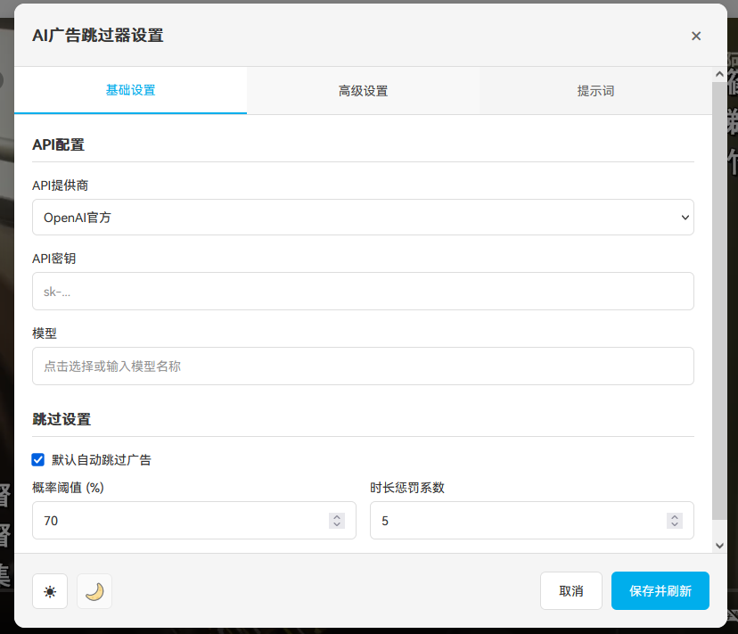

# B站视频广告跳过助手 (Bilibili Ad Skipper)


[](https://opensource.org/licenses/MIT)
[](https://greasyfork.org/zh-CN/scripts/539827-bilibili-video-ad-skipper)
[](https://www.javascript.com/)
[](#)

这是一款功能强大的油猴脚本，它利用 AI 代理（Agent）智能分析 Bilibili 视频的弹幕和评论，以概率形式精准检测并自动跳过视频中内置的商业广告（恰饭）部分。

## 目录
- [✨ 功能特点](#-功能特点)
- [📸 效果截图](#-效果截图)
- [🚀 安装步骤](#-安装步骤)
  - [油猴脚本安装](#油猴脚本安装)
  - [浏览器扩展安装 (推荐)](#浏览器扩展安装-推荐)
- [️ 配置说明](#️-配置说明)
- [💡 使用方法](#-使用方法)
- [核心提示词 (Prompt)](#核心提示词-prompt)
- [🤝 贡献](#-贡献)
- [📜 许可证](#-许可证)
- [⚠️ 免责声明](#️-免责声明)

## ✨ 功能特点

-   **🤖 AI 驱动分析**：调用大语言模型（如 Gemini 系列）作为智能代理，深度理解弹幕和评论的上下文语境，而非简单的关键词匹配。
-   **🎯 多维度检测**：同时分析**海量弹幕**和**置顶评论**，结合两种信息源，大幅提升广告识别的准确率。
-   **📈 概率化结果**：AI 会给出广告的概率评估（0-100%），并根据广告时长进行智能惩罚调整，让判断更科学。
-   **⚙️ 高度可配置**：用户可以自由配置 API Key、API Base URL、AI 模型、自动跳过概率阈值和时长惩罚系数。
-   **🎨 友好用户界面**：
    -   悬浮设置按钮，方便随时调整参数。
    -   清晰的 AI 分析结果弹窗，展示概率、时间、分析依据等信息。
    -   实时的 Toast 通知，反馈脚本运行状态。
    -   可拖拽的弹窗，不影响正常观看体验。
-   **⚡️ 智能自动跳过**：当检测到的广告概率超过设定阈值时，脚本将在播放到广告开始时间时，自动将视频进度条跳转到广告结束时间。

## 📸 效果截图

### 设置界面
用户可以轻松配置自己的 AI 服务参数。



### AI 分析结果
分析完成后，脚本会以弹窗形式展示详细结果，用户可根据结果选择是否启用自动跳过。


## 🚀 安装步骤

### 油猴脚本安装
1.  **安装脚本管理器**
    首先，你的浏览器需要安装一个用户脚本管理器扩展。推荐使用 [**Tampermonkey**](https://www.tampermonkey.net/)。
    -   [Chrome 安装地址](https://chrome.google.com/webstore/detail/tampermonkey/dhdgffkkebhmkfjojejmpbldmpobfkfo)
    -   [Firefox 安装地址](https://addons.mozilla.org/en-US/firefox/addon/tampermonkey/)
    -   [Edge 安装地址](https://microsoftedge.microsoft.com/addons/detail/tampermonkey/iikmkjmpaadaobahmlepofghlfgfgbfp)

2.  **安装本脚本**
    -   点击此处安装：[Bilibili Video Ad Skipper](https://greasyfork.org/zh-CN/scripts/539827-bilibili-video-ad-skipper)
    -   或者，从源代码安装：打开 Tampermonkey 管理面板，新建脚本，将项目中的 `.js` 文件内容完整复制进去并保存。

### 浏览器扩展安装 (推荐)

除了油猴脚本，本项目也提供浏览器扩展版本，推荐使用此方式获得更佳体验和自动更新：

1.  **下载扩展**：
    -   前往 [GitHub Releases 页面](https://github.com/StarsWhere/Bilibili-Video-Ad-Skipper/releases) 下载最新版本的 `bilibili-ad-skipper.zip` 文件。
    -   解压下载的 `.zip` 文件到一个你方便找到的文件夹（例如：`bilibili-ad-skipper-extension`）。

2.  **安装到浏览器**：
    -   **Chrome / Edge**:
        1.  打开浏览器，访问 `chrome://extensions` (Chrome) 或 `edge://extensions` (Edge)。
        2.  开启右上角的“开发者模式”（Developer mode）。
        3.  点击“加载已解压的扩展程序”（Load unpacked），然后选择你刚才解压的 `bilibili-ad-skipper-extension` 文件夹。
        4.  扩展程序会出现在列表中，确保其已启用。
    -   **Firefox**:
        1.  打开浏览器，访问 `about:debugging#/runtime/this-firefox`。
        2.  点击“临时加载附加组件”（Load Temporary Add-on）。
        3.  选择你解压文件夹中的 `manifest.json` 文件。
        4.  **注意**：Firefox 的临时加载在浏览器关闭后会失效，每次重启浏览器都需要重新加载。

## ️ 配置说明

本脚本**需要您提供自己的 AI 服务 API Key** 才能正常工作。

1.  打开任意一个 Bilibili 视频页面。
2.  点击页面右侧出现的**齿轮图标**⚙️，打开“AI 广告跳过设置”窗口。
3.  填写以下配置项：
    -   **API Base URL**: 你的 AI 服务 API 地址。
        -   如果你使用 OpenAI 官方服务，通常是 `https://api.openai.com`。
        -   如果你使用第三方代理或自建服务，请填写对应的地址。
    -   **API Key**: 你的 API 密钥。请注意保密，不要泄露。
    -   **模型名称**: 你想使用的 AI 模型，例如 `gpt-3.5-turbo` 或 `gpt-4`。
        **注意**：推荐使用 `deepseek-V3`、`gemini-1.5-flash` 及以上模型以获得良好表现。低于此性能的模型可能因无法正确分析广告范围而无法使用。每次发送请求约消耗 2000-4000 token，响应约 100-200 token。（OpenAI未测试，如果你能提供测试数据，请告诉我）
    -   **概率阈值 (%)**: AI 分析出的广告概率**高于**此值时，才会默认勾选“自动跳过”。默认 `70`。
    -   **时长惩罚 (%/分钟)**: AI 识别出的广告时间每增加一分钟，广告概率会降低的百分比。用于防止将过长的正常内容误判为广告。默认 `5`。
    -   **默认启用自动跳过**: 总开关。如果取消勾选，即使概率达标，也不会默认开启跳过功能。
4.  点击**保存**。配置完成后，脚本将在新打开的视频页自动运行。

### 高级设置 (Advanced Settings)

在设置界面的“高级设置”标签页中，您可以对脚本的更深层行为进行调整，以满足个性化需求：

-   **广告时长限制**：
    -   **最小广告时长 (秒)** (`minAdDuration`): AI 识别出的广告时长若低于此值，将受到惩罚性概率降低。默认 `30` 秒。
    -   **最大广告时长 (秒)** (`maxAdDuration`): AI 识别出的广告时长若高于此值，将受到惩罚性概率降低。默认 `300` 秒。

-   **弹幕过滤设置**：
    -   **最大弹幕数量 (用于分析)** (`maxDanmakuCount`): 当过滤后的弹幕数量超过此值时，脚本将随机采样，只取最多此数量的弹幕进行 AI 分析，以优化性能。默认 `500` 条。
    -   **完整分析所需最小弹幕数** (`minDanmakuForFullAnalysis`): 当有效弹幕数量低于此值时，脚本可能跳过 AI 深度分析，或采用简化逻辑判断，以避免在弹幕稀少时进行无效的 AI 调用。默认 `50` 条。

-   **白名单设置**：
    -   **启用白名单 (仅分析含白名单关键词的弹幕)** (`enableWhitelist`): 开启后，AI 将只分析包含白名单中关键词的弹幕。默认启用。
    -   **白名单支持正则表达式** (`whitelistRegex`): 勾选后，白名单中的关键词将被视为正则表达式进行匹配。
    -   **白名单** (`whitelist`): 您可以添加希望 AI 重点关注的弹幕关键词或正则表达式（例如：`分`, `秒`, `空降`, `指路`）。

-   **黑名单设置**：
    -   **启用黑名单 (过滤掉含黑名单关键词的弹幕)** (`enableBlacklist`): 开启后，AI 将过滤掉包含黑名单中关键词的弹幕，避免干扰判断。默认启用。
    -   **黑名单支持正则表达式** (`blacklistRegex`): 勾选后，黑名单中的关键词将被视为正则表达式进行匹配。
    -   **黑名单** (`blacklist`): 您可以添加不希望 AI 分析的弹幕关键词或正则表达式（例如：`正片`, `省流`, `总结`）。

## 💡 使用方法

1.  完成安装和配置后，打开任意一个 Bilibili 视频页面。
2.  脚本会自动在后台开始执行分析流程（获取信息 -> 获取弹幕 -> 发送给 AI）。你会看到右下角弹出系列状态提示。
3.  分析完成后，右下角会弹出**“AI 分析结果”**卡片。
4.  卡片上会清晰地展示**广告概率**、**预估的起止时间**和**AI的分析依据**。
5.  如果广告概率达到了你设定的阈值，**“自动跳过广告”**的复选框会默认勾选。
6.  当视频播放到广告开始时间时，脚本会自动帮你跳过这段内容。你也可以随时在结果卡片上手动取消勾选来禁用本次跳过。

## 核心提示词 (Prompt)
本脚本通过以下核心提示词（Prompt）指导 AI Agent 完成分析任务，保证了分析的专业性和输出格式的稳定性。

```
### Agent Prompt (提示词)
**角色 (Role):**
你是一个智能agent,专门分析Bilibili视频的弹幕以检测其中包含的商业广告(硬广)时间段。

**任务 (Task):**
你收到的内容包含两部分:
1. 经过整理后的弹幕文本,格式为 `MM:SS` 或 `HH:MM:SS`
2. 视频的第一条评论内容及其状态(是否为置顶评论)
你的核心任务是根据这些信息,判断视频是否含有广告,确定广告的时间段,并给出广告概率评估。

**工作流程与逻辑 (Workflow & Logic):**
**识别广告标记弹幕**:
   - 寻找"时间跳转"或"广告提示"类弹幕。
   - 常见模式:`X分Y秒`, `X:Y`, `X.Y`, `感谢XX君`, `空降坐标`, `指路牌`, `xx秒后`等。
   - 注意:忽略含有"正片"、"省流"的弹幕,这些通常指向正常内容, 弹幕不会存在商业推广内容，你只是需要评估是否有类似`路标`的弹幕存在即可

3. **广告概率评估标准**:
   - **90-100%**: 多条弹幕指向同一时间点。
   - **70-89%**: 复数弹幕指向同一时间点,模式明确,即使评论无广告信息。
   - **50-69%**: 存在弹幕指向时间点,但模式相对明确。
   - **30-49%**: 弹幕证据较弱,但存在一些可疑指向。
   - **10-29%**: 非常微弱的证据。
   - **0-9%**: 基本无广告证据。

4. **时间确定**:
   - **广告结束时间**: 弹幕指向的目标时间点。
   - **广告开始时间**: 指向该时间的最早弹幕的发送时间戳。

5. **处理无广告情况**:
   - 如果弹幕中的数字都是描述性的,且没有明确的时间跳转指示。

**输出格式 (Output Format):**
统一返回以下JSON格式:
{
  "probability": 数字(0-100, 表示广告存在的概率),
  "start": "开始时间(格式: MM:SS 或 HH:MM:SS, 如果没有则为null)",
  "end": "结束时间(格式: MM:SS 或 HH:MM:SS, 如果没有则为null)",
  "note": "分析说明"
}

**注意事项**:
- probability: 0-100的整数,表示广告概率百分比。
- start/end: 当probability >= 30时必须提供,否则可为null。
- note: 必须详细说明判断依据。
- 输出必须是纯JSON,不包含任何其他文本或markdown标记。

**最终指令 (Final Instruction):**
你的输出**必须且只能是**一个纯粹的、格式正确的JSON对象。**绝对禁止**包含任何JSON之外的文本。
```

## 🤝 贡献

欢迎任何形式的贡献！如果你有好的想法、建议或发现了 Bug，请随时提交 [Issues](https://github.com/YOUR-USERNAME/YOUR-REPO/issues) 或 [Pull Requests](https://github.com/YOUR-USERNAME/YOUR-REPO/pulls)。 <!-- 请将 YOUR-USERNAME/YOUR-REPO 替换为你的 GitHub 仓库地址 -->

## 📜 许可证

本项目基于 [MIT License](./LICENSE) 开源。

## ⚠️ 免责声明

-   本脚本为开源的本地工具，仅供学习和技术交流使用，作者不对其造成的任何后果负责。
-   使用本脚本调用 AI 服务产生的**一切费用由用户自行承担**。
-   Bilibili 网站的结构可能随时变化，可能导致脚本部分或全部功能失效，作者会尽力维护，但不作任何保证。